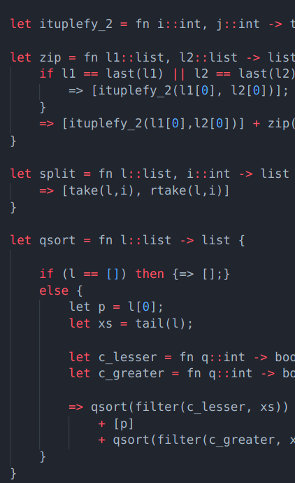
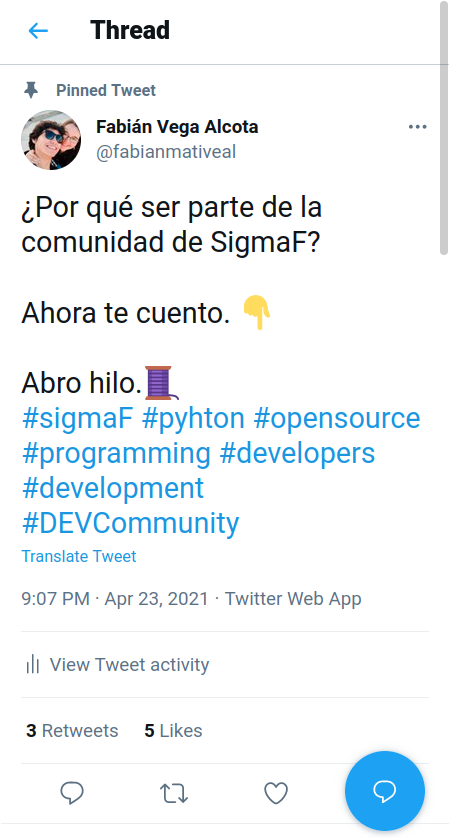
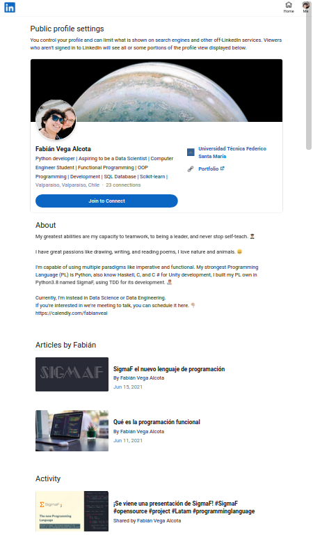
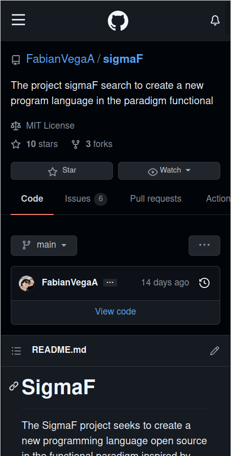

<style>
h1,h2,h3{
  transition: 1s;
}
h1:hover, h2:hover, h3:hover{
  color:#55a1f3;
  margin-left: 5%;
}
</style>


<style scoped>
img[src*="sigmaf"] {
  padding-top: 10px;
  margin-left: 20%
}
section {
  padding-top: 15px;
}
</style>





## The new Programming Language


```plane-text
Welcome to SigmaF, the Program Language of the future
for the Programming Functional and a lot more.
```

---
<style scoped>
img[src*="python"]{
  padding-top: 10px;
  margin-left: 24%
}
img[src*="arrow"]{
  padding-top: 10px;
  margin-left: 40%
}
img[src*="haskell"]{
  padding-top: 10px;
  margin-left: 57%
}
img{
  width: 12%;
  transition: 1s;
  position:fixed;
}
img[src*="python"]:hover, img[src*="haskell"]:hover{
  width: 15%;
}
img[src*="arrow"]:hover{
  margin-left: 43%;
}
</style>

# ¿Qué es SigmaF?


Un lenguaje de programación de Paradigma Funcional y open-source.

</br>
</br>


  

---

### Lineamentos del lenguaje

- Escalabilidad
- Legibilidad
- Simplicidad
- Comprensibilidad

---

## ¿Por qué ser parte de su comunidad?

1. Un codigo sencillo y entendible
2. Un gran potencial
3. Desarrollo escalable
4. Sencilles y potencia
5. Respeto y diversidad

---

## ¿Cómo comenzar a contribuir?
<style scoped>
section{
  display: inline-block;
}
img[src*="link"]{
  padding-top: 10px;
  margin-left: 30%
}
img[src*="git"]{
  padding-top: 10px;
  margin-left: 60%
}
img{
  height: 490px;
  margin: auto 3%;
  position: fixed;
  transition: 1s;
}
img:hover{
  height: 530px;
}
</style>

  

---

# ¿Cómo comienzo a probarlo?

En el repositorio de SigmaF encontrarán un tutorial para instalarlo vía ejecutable en Linux y también lo puedes clonar el repositorio y usarlo ejecutando con:

``` shell
$ python3.8 main.py -ncover
```

Y listo, ya puedes hacer tu primer _"Hello, World"_ con SigmaF.

```Haskell
printLn("Hello, World");
```

---


# Recursos
- [SigmaF el nuevo lenguaje de programación](https://www.linkedin.com/pulse/sigmaf-el-nuevo-lenguaje-de-programaci%C3%B3n-fabi%C3%A1n-vega-alcota/)

- [Qué es la programación funcional](https://www.linkedin.com/pulse/qu%C3%A9-es-la-programaci%C3%B3n-funcional-fabi%C3%A1n-vega-alcota/)

- [SigmaF Repositorio](https://github.com/FabianVegaA/sigmaF)


<style scoped>
img{
  margin-left: 5%;
  width: 4%;
}
img[src*="twitter"]{
  margin-left: 0%;
}
img[src*="github"]{
  width: 5%;
}
</style>
### Contáctame
 [Twitter](https://twitter.com/fabianmativeal)   [LinkedIn](https://www.linkedin.com/in/fabi%C3%A1n-vega-alcota/) [GitHub]() 

---

<style scoped>
img[src*="sigma"] {
  width: 50%;
  margin-left: 20%;
  transition:1s;
  position: fixed;
}
section {
  padding-top: 15%;
}
h1 {
  font-size: 80px;
  margin-left: 11%;
  margin-top: 25%;
}
img[src*="sigma"]:hover {
  width: 60%;
  margin-left: 16%;
}
p{
  color: transparent;
  transition: 1s;
}
p:hover{
  color:purple;
}

</style>

# ¡Hagamos grandes cosas!

Enchulado por Camilú